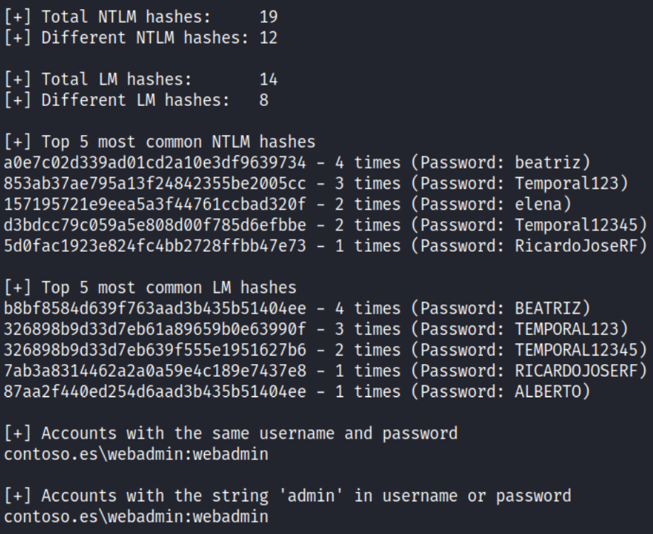
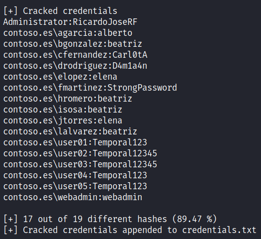

# ntds-analyzer

A tool to analyze hashes in Ntds.dit files once the NTLM and LM hashes have been cracked.

- Top most common NTLM and LM hashes

- List of accounts using the same username and password

- Calculate the plaintext password when the LM hash has been cracked but not the NTLM (explained [here](https://github.com/ricardojoserf/LM_original_password_cracker))

- List of credentials in *user:password* format


### Usage

```
python3 analyzer.py -f NTDS.DIT [-n NTLM_CRACKED_HASHES] [-l LM_CRACKED_HASHES]
```

### Example

```
python3 analyzer.py -f test_files/ntds.dit -n test_files/ntlm_cracked.txt -l test_files/lm_cracked.txt
```

We start with 4 NTLM and 8 LM cracked hashes and the Ntds.dit file:


The script shows the number of hashes, the most common ones and which accounts use the same username and password:



Then it shows the cracked hashes. Before we had 4 NTLM hashes cracked and now we have 10! That is because we calculated the password from the related LM hashes:


Finally we get the list of users and their passwords in *user:password* format and the result is dumped to the "credentials.txt" file:


