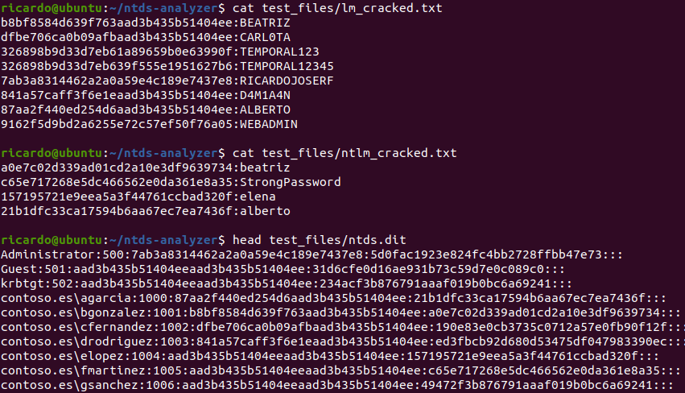
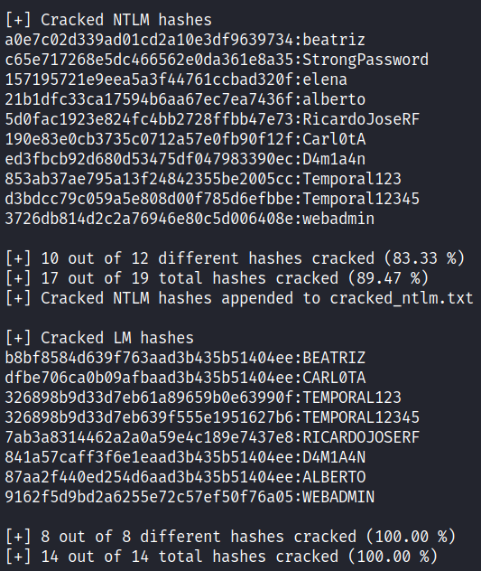

# ntds-analyzer

A tool to analyze hashes in Ntds.dit files once the NTLM and LM hashes have been cracked.

- Top most common NTLM and LM hashes

- Calculate the plaintext password when the LM hash has been cracked but not the NTLM (explained [here](https://github.com/ricardojoserf/LM_original_password_cracker))

- List of credentials in *user:password* format


### Usage

```
python3 analyzer.py -f NTDS.DIT -n NTLM_CRACKED_HASHES -l LM_CRACKED_HASHES
```

### Example

```
python3 analyzer.py -f test_files/ntds.dit -n test_files/ntlm_cracked.txt -l test_files/lm_cracked.txt
```

We start with 5 NTLM and 7 LM cracked hashes and the ntds.dit file:



The script shows the number of hashes and the most common ones:


Then it shows the cracked hashes. We have 11 NTLM hashes now because we calculated the password from the related LM hashes (explained [here](https://github.com/ricardojoserf/LM_original_password_cracker)):



Finally we get the list of users and their passwords in *user:password* format:

